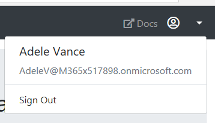

<!-- markdownlint-disable MD002 MD041 -->

В этом упражнении вы будете расширяем приложение из предыдущего упражнения для поддержки проверки подлинности с помощью Azure AD. Это необходимо для получения необходимого маркера доступа OAuth для вызова Microsoft Graph. На этом этапе в приложение будет интегрироваться библиотека [запросов – OAuthlib](https://requests-oauthlib.readthedocs.io/en/latest/) .

1. Создайте в корневом каталоге проекта новый файл с именем `oauth_settings.yml`и добавьте приведенный ниже контент.

    :::code language="ini" source="../demo/graph_tutorial/oauth_settings.yml.example":::

1. Замените `YOUR_APP_ID_HERE` идентификатором приложения на портале регистрации приложений и замените `YOUR_APP_SECRET_HERE` созданным паролем.

> [!IMPORTANT]
> Если вы используете систему управления версиями (например, Git), то теперь следует исключить из системы управления версиями файл **oauth_settings. yml** , чтобы избежать непреднамеренного утечки идентификатора и пароля приложения.

## <a name="implement-sign-in"></a>Реализация входа

1. Создайте новый файл в каталоге **./туториал** `auth_helper.py` и добавьте указанный ниже код.

    :::code language="python" source="../demo/graph_tutorial/tutorial/auth_helper.py" id="FirstCodeSnippet":::

    Этот файл будет содержать все методы, связанные с проверкой подлинности. `get_sign_in_url` Создается URL-адрес авторизации, а `get_token_from_code` метод обменивается с ответом авторизации для маркера доступа.

1. Добавьте следующие `import` операторы в верхнюю часть файла **./туториал/виевс.Пи**.

    ```python
    from django.urls import reverse
    from tutorial.auth_helper import get_sign_in_url, get_token_from_code
    ```

1. Добавьте представление входа в файл **./туториал/виевс.Пи** .

    :::code language="python" source="../demo/graph_tutorial/tutorial/views.py" id="SignInViewSnippet":::

1. Добавьте представление обратного вызова в файл **./туториал/виевс.Пи** .

    ```python
    def callback(request):
      # Get the state saved in session
      expected_state = request.session.pop('auth_state', '')
      # Make the token request
      token = get_token_from_code(request.get_full_path(), expected_state)
      # Temporary! Save the response in an error so it's displayed
      request.session['flash_error'] = { 'message': 'Token retrieved', 'debug': format(token) }
      return HttpResponseRedirect(reverse('home'))
    ```

    Рассмотрите то, что делает эти представления:

    - `signin` Действие создает URL-адрес входа Azure AD, сохраняет `state` значение, созданное клиентом OAuth, а затем перенаправляет браузер на страницу входа Azure AD.

    - `callback` Действие перенаправляет Azure после завершения входа. Это действие гарантирует, что `state` значение соответствует сохраненному значению, а затем использует код проверки подлинности, отправленный Azure для запроса маркера доступа. Затем он перенаправляется обратно на домашнюю страницу с маркером доступа во временном значении ошибки. Вы будете использовать этот параметр, чтобы проверить, работает ли наш вход перед переходом.

1. Откройте **./туториал/урлс.Пи** и замените существующие `path` операторы `signin` на приведенные ниже.

    ```python
    path('signin', views.sign_in, name='signin'),
    ```

1. Добавление нового `path` `callback` представления.

    ```python
    path('callback', views.callback, name='callback'),
    ```

1. Запустите сервер и перейдите к `https://localhost:8000`. Нажмите кнопку входа, и вы будете перенаправлены на `https://login.microsoftonline.com`. Войдите с помощью учетной записи Майкрософт и согласия с запрошенными разрешениями. Браузер перенаправляется на приложение, отображая маркер.

### <a name="get-user-details"></a>Получение сведений о пользователе

1. Создайте новый файл в каталоге **./туториал** `graph_helper.py` и добавьте указанный ниже код.

    :::code language="python" source="../demo/graph_tutorial/tutorial/graph_helper.py" id="FirstCodeSnippet":::

    `get_user` Метод создает запрос GET к конечной точке Microsoft Graph `/me` для получения профиля пользователя с помощью маркера доступа, полученного ранее.

1. Обновите `callback` метод в файле **./туториал/виевс.Пи** , чтобы получить профиль пользователя из Microsoft Graph. Добавьте следующий `import` оператор в начало файла.

    ```python
    from tutorial.graph_helper import get_user
    ```

1. Замените `callback` метод на приведенный ниже код.

    ```python
    def callback(request):
      # Get the state saved in session
      expected_state = request.session.pop('auth_state', '')
      # Make the token request
      token = get_token_from_code(request.get_full_path(), expected_state)

      # Get the user's profile
      user = get_user(token)
      # Temporary! Save the response in an error so it's displayed
      request.session['flash_error'] = { 'message': 'Token retrieved',
        'debug': 'User: {0}\nToken: {1}'.format(user, token) }
      return HttpResponseRedirect(reverse('home'))
    ```

Новый код вызывает `get_user` метод, чтобы запросить профиль пользователя. Он добавляет объект пользователя во временный выход для тестирования.

## <a name="storing-the-tokens"></a>Сохранение маркеров

Теперь, когда вы можете получить маркеры, следует реализовать способ их хранения в приложении. Так как это пример приложения, для простоты вы будете хранить их в сеансе. Реальное приложение использует более надежное решение для безопасного хранения, например базу данных.

1. Добавьте следующие новые методы в файле **./туториал/auth_helper. корректировки**.

    ```python
    def store_token(request, token):
      request.session['oauth_token'] = token

    def store_user(request, user):
      request.session['user'] = {
        'is_authenticated': True,
        'name': user['displayName'],
        'email': user['mail'] if (user['mail'] != None) else user['userPrincipalName']
      }

    def get_token(request):
      token = request.session['oauth_token']
      return token

    def remove_user_and_token(request):
      if 'oauth_token' in request.session:
        del request.session['oauth_token']

      if 'user' in request.session:
        del request.session['user']
    ```

1. Обновите `callback` функцию в файле **./туториал/виевс.Пи** , чтобы сохранить маркеры в сеансе и переадресовать обратно на главную страницу. Замените `from tutorial.auth_helper import get_sign_in_url, get_token_from_code` строку на приведенную ниже строку.

    ```python
    from tutorial.auth_helper import get_sign_in_url, get_token_from_code, store_token, store_user, remove_user_and_token, get_token
    ```

1. Замените `callback` метод на приведенный ниже.

    :::code language="python" source="../demo/graph_tutorial/tutorial/views.py" id="CallbackViewSnippet":::

## <a name="implement-sign-out"></a>Реализация выхода

1. Добавление нового `sign_out` представления в файле **./туториал/виевс.Пи**.

    :::code language="python" source="../demo/graph_tutorial/tutorial/views.py" id="SignOutViewSnippet":::

1. Откройте **./туториал/урлс.Пи** и замените существующие `path` операторы `signout` на приведенные ниже.

    ```python
    path('signout', views.sign_out, name='signout'),
    ```

1. Перезапустите сервер и пройдите процесс входа. Необходимо вернуться на домашнюю страницу, но пользовательский интерфейс должен измениться, чтобы показать, что вы вошли в систему.

    

1. Щелкните аватар пользователя в правом верхнем углу, чтобы получить доступ к ссылке **выхода** . При нажатии кнопки **выйти** сбрасывается сеанс и возвращается на домашнюю страницу.

    

## <a name="refreshing-tokens"></a>Обновление маркеров

На этом шаге приложение имеет маркер доступа, который отправляется в `Authorization` заголовке вызовов API. Это маркер, который позволяет приложению получать доступ к Microsoft Graph от имени пользователя.

Однако этот маркер кратковременно используется. Срок действия маркера истечет через час после его выдачи. В этом случае маркер обновления становится полезен. Маркер обновления позволяет приложению запросить новый маркер доступа, не требуя от пользователя повторного входа. Обновите код управления маркером, чтобы реализовать обновление маркеров.

1. Замените существующий `get_token` метод в файле **./туториал/auth_helper. корректировки** на следующий.

    :::code language="python" source="../demo/graph_tutorial/tutorial/auth_helper.py" id="GetTokenSnippet":::

    Этот метод сначала проверяет, истек ли срок действия маркера доступа, или закройте его до истечения срока действия. Если это так, то он использует маркер обновления для получения новых токенов, затем обновляет кэш и возвращает новый маркер доступа.
