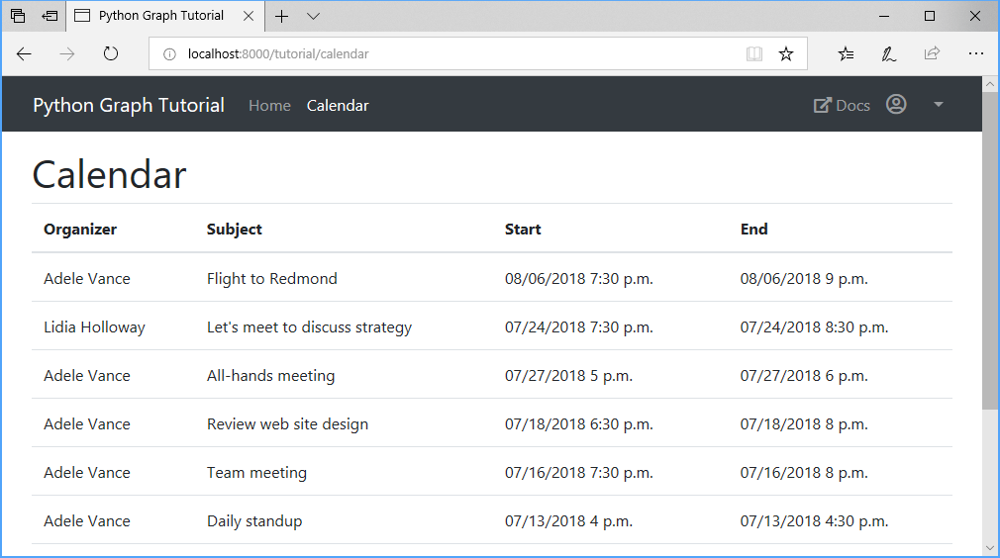

<!-- markdownlint-disable MD002 MD041 -->

<span data-ttu-id="4b72e-101">В этом упражнении вы добавите Microsoft Graph в приложение.</span><span class="sxs-lookup"><span data-stu-id="4b72e-101">In this exercise you will incorporate the Microsoft Graph into the application.</span></span> <span data-ttu-id="4b72e-102">Для этого приложения вы будете использовать библиотеку [запросов — OAuthlib](https://requests-oauthlib.readthedocs.io/en/latest/) , чтобы совершать вызовы в Microsoft Graph.</span><span class="sxs-lookup"><span data-stu-id="4b72e-102">For this application, you will use the [Requests-OAuthlib](https://requests-oauthlib.readthedocs.io/en/latest/) library to make calls to Microsoft Graph.</span></span>

## <a name="get-calendar-events-from-outlook"></a><span data-ttu-id="4b72e-103">Получение событий календаря из Outlook</span><span class="sxs-lookup"><span data-stu-id="4b72e-103">Get calendar events from Outlook</span></span>

<span data-ttu-id="4b72e-104">Для начала добавьте метод `./tutorial/graph_helper.py` для извлечения событий календаря.</span><span class="sxs-lookup"><span data-stu-id="4b72e-104">Start by adding a method to `./tutorial/graph_helper.py` to fetch the calendar events.</span></span> <span data-ttu-id="4b72e-105">Добавьте указанный ниже метод.</span><span class="sxs-lookup"><span data-stu-id="4b72e-105">Add the following method.</span></span>

```python
def get_calendar_events(token):
  graph_client = OAuth2Session(token=token)

  # Configure query parameters to
  # modify the results
  query_params = {
    '$select': 'subject,organizer,start,end',
    '$orderby': 'createdDateTime DESC'
  }

  # Send GET to /me/events
  events = graph_client.get('{0}/me/events'.format(graph_url), params=query_params)
  # Return the JSON result
  return events.json()
```

<span data-ttu-id="4b72e-106">Рассмотрите, что делает этот код.</span><span class="sxs-lookup"><span data-stu-id="4b72e-106">Consider what this code is doing.</span></span>

- <span data-ttu-id="4b72e-107">URL-адрес, который будет вызываться — это `/v1.0/me/events`.</span><span class="sxs-lookup"><span data-stu-id="4b72e-107">The URL that will be called is `/v1.0/me/events`.</span></span>
- <span data-ttu-id="4b72e-108">`$select` Параметр позволяет ограничить поля, возвращаемые для каждого события, только теми, которые будут реально использоваться представлением.</span><span class="sxs-lookup"><span data-stu-id="4b72e-108">The `$select` parameter limits the fields returned for each events to just those the view will actually use.</span></span>
- <span data-ttu-id="4b72e-109">`$orderby` Параметр сортирует результаты по дате и времени создания, начиная с самого последнего элемента.</span><span class="sxs-lookup"><span data-stu-id="4b72e-109">The `$orderby` parameter sorts the results by the date and time they were created, with the most recent item being first.</span></span>

<span data-ttu-id="4b72e-110">Теперь создайте представление календаря.</span><span class="sxs-lookup"><span data-stu-id="4b72e-110">Now create a calendar view.</span></span> <span data-ttu-id="4b72e-111">В `./tutorial/views.py` `from tutorial.graph_helper import get_user` строке, сначала измените строку на следующий.</span><span class="sxs-lookup"><span data-stu-id="4b72e-111">In `./tutorial/views.py`, first change the `from tutorial.graph_helper import get_user` line to the following.</span></span>

```python
from tutorial.graph_helper import get_user, get_calendar_events
```

<span data-ttu-id="4b72e-112">Затем добавьте следующее представление в `./tutorial/views.py`.</span><span class="sxs-lookup"><span data-stu-id="4b72e-112">Then, add the following view to `./tutorial/views.py`.</span></span>

```python
def calendar(request):
  context = initialize_context(request)

  token = get_token(request)

  events = get_calendar_events(token)

  context['errors'] = [
    { 'message': 'Events', 'debug': format(events)}
  ]

  return render(request, 'tutorial/home.html', context)
```

<span data-ttu-id="4b72e-113">Обновление `./tutorial/urls.py` для добавления нового представления.</span><span class="sxs-lookup"><span data-stu-id="4b72e-113">Update `./tutorial/urls.py` to add this new view.</span></span>

```python
path('calendar', views.calendar, name='calendar'),
```

<span data-ttu-id="4b72e-114">Наконец, обновите \*\*\*\* ссылку на календарь `./tutorial/templates/tutorial/layout.html` , чтобы создать ссылку на это представление.</span><span class="sxs-lookup"><span data-stu-id="4b72e-114">Finally, update  the **Calendar** link in `./tutorial/templates/tutorial/layout.html` to link to this view.</span></span> <span data-ttu-id="4b72e-115">Замените `<a class="nav-link active" href="#">Calendar</a>` строку на приведенную ниже строку.</span><span class="sxs-lookup"><span data-stu-id="4b72e-115">Replace the `<a class="nav-link active" href="#">Calendar</a>` line with the following.</span></span>

```html
<a class="nav-link active" href="">Calendar</a>
```

<span data-ttu-id="4b72e-116">Теперь вы можете протестировать это.</span><span class="sxs-lookup"><span data-stu-id="4b72e-116">Now you can test this.</span></span> <span data-ttu-id="4b72e-117">Войдите и щелкните ссылку **Календарь** на панели навигации.</span><span class="sxs-lookup"><span data-stu-id="4b72e-117">Sign in and click the **Calendar** link in the nav bar.</span></span> <span data-ttu-id="4b72e-118">Если все работает, вы должны увидеть дамп событий JSON в календаре пользователя.</span><span class="sxs-lookup"><span data-stu-id="4b72e-118">If everything works, you should see a JSON dump of events on the user's calendar.</span></span>

## <a name="display-the-results"></a><span data-ttu-id="4b72e-119">Отображение результатов</span><span class="sxs-lookup"><span data-stu-id="4b72e-119">Display the results</span></span>

<span data-ttu-id="4b72e-120">Теперь можно добавить шаблон для отображения результатов более удобным для пользователя способом.</span><span class="sxs-lookup"><span data-stu-id="4b72e-120">Now you can add a template to display the results in a more user-friendly manner.</span></span> <span data-ttu-id="4b72e-121">Создайте новый файл в `./tutorial/templates/tutorial` каталоге `calendar.html` и добавьте указанный ниже код.</span><span class="sxs-lookup"><span data-stu-id="4b72e-121">Create a new file in the `./tutorial/templates/tutorial` directory named `calendar.html` and add the following code.</span></span>

```html


<h1>Calendar</h1>
<table class="table">
  <thead>
    <tr>
      <th scope="col">Organizer</th>
      <th scope="col">Subject</th>
      <th scope="col">Start</th>
      <th scope="col">End</th>
    </tr>
  </thead>
  <tbody>
    
      
        <tr>
          <td>{{ event.organizer.emailAddress.name }}</td>
          <td>{{ event.subject }}</td>
          <td>{{ event.start.dateTime|date:'SHORT_DATETIME_FORMAT' }}</td>
          <td>{{ event.end.dateTime|date:'SHORT_DATETIME_FORMAT' }}</td>
        </tr>
      
    
  </tbody>
</table>

```

<span data-ttu-id="4b72e-122">Это приведет к перебору коллекции событий и добавлению строки таблицы для каждой из них.</span><span class="sxs-lookup"><span data-stu-id="4b72e-122">That will loop through a collection of events and add a table row for each one.</span></span> <span data-ttu-id="4b72e-123">Добавьте следующий `import` оператор в начало `./tutorials/views.py` файла.</span><span class="sxs-lookup"><span data-stu-id="4b72e-123">Add the following `import` statement to the top of the `./tutorials/views.py` file.</span></span>

```python
import dateutil.parser
```

<span data-ttu-id="4b72e-124">Замените `calendar` представление на `./tutorial/views.py` приведенный ниже код.</span><span class="sxs-lookup"><span data-stu-id="4b72e-124">Replace the `calendar` view in `./tutorial/views.py` with the following code.</span></span>

```python
def calendar(request):
  context = initialize_context(request)

  token = get_token(request)

  events = get_calendar_events(token)

  if events:
    # Convert the ISO 8601 date times to a datetime object
    # This allows the Django template to format the value nicely
    for event in events['value']:
      event['start']['dateTime'] = dateutil.parser.parse(event['start']['dateTime'])
      event['end']['dateTime'] = dateutil.parser.parse(event['end']['dateTime'])

    context['events'] = events['value']

  return render(request, 'tutorial/calendar.html', context)
```

<span data-ttu-id="4b72e-125">Обновите страницу, после чего приложение должно отобразить таблицу событий.</span><span class="sxs-lookup"><span data-stu-id="4b72e-125">Refresh the page and the app should now render a table of events.</span></span>


